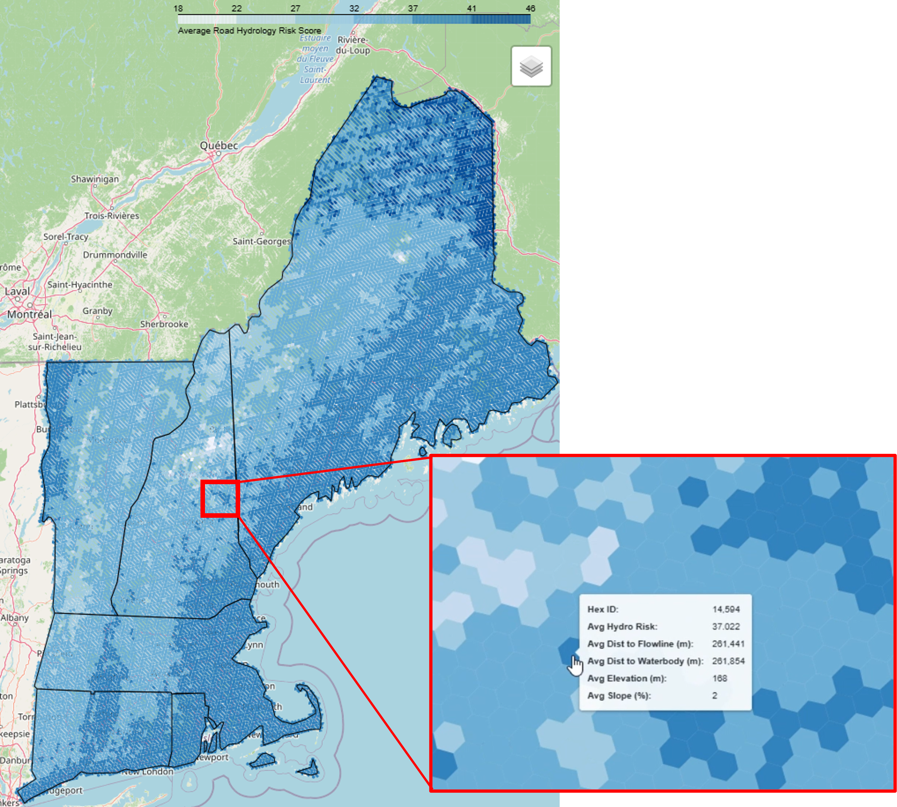

# postgis-road-flood-risk

A PostGIS‑driven geospatial workflow that builds a hex‑grid flood‑risk surface by integrating road geometry, hydrology proximity metrics, and terrain features into a reproducible spatial analysis pipeline.

### **View the [interactive map here](docs/hex_2km_avg_road_hydro_risk_map.html).**

## Workflow

This project follows an end‑to‑end PostGIS geospatial engineering workflow, using a flood‑risk analysis as the example application.

1. **Create a PostgreSQL database with PostGIS enabled**  
   Initialize the spatial database and confirm PostGIS extensions and versions.

2. **Fetch source datasets for the Northeastern United States**  
   - OSM road network  
   - NHD flowlines and waterbodies  
   - USGS DEM tiles  
   - State boundary polygons  

3. **Ingest all datasets into PostGIS**  
   Use `osm2pgsql`, GDAL utilities, and spatial SQL to load, validate, and index each dataset.

4. **Prepare and clean spatial tables**  
   - Filter roads to relevant classes  
   - Normalize geometry types  
   - Build spatial indexes  
   - Clip datasets to the study region  

5. **Generate road midpoints and hydrologic attributes**  
   - 27,664,065 road segments processed  
   - Compute slope, elevation, distance to nearest flowline, and distance to nearest waterbody  
   - Store all attributes in a dedicated analysis schema

6. **Aggregate features into a hex‑grid surface**  
   - Build a uniform 2km hex grid across the region  
   - Spatially join road‑level attributes into hex‑level averages  
   - Produce a continuous flood‑risk surface for visualization

7. **Visualize results with Folium**  
   - Choropleth map of hex‑grid flood risk  
   - State boundary overlays  
   - Interactive tooltips for all hex attributes  
   - Export to a standalone HTML map

## Scoring Approach

Each road segment receives a hydrology‑based flood‑risk score derived from four normalized components. Scores are aggregated to the hex‑grid for visualization.

### **Flowline Proximity — 40%**
- Closer to a flowline = higher modeled risk  
- Scored using an exponential decay function with a 100 m scale  
- Produces a 0–1 value

### **Waterbody Proximity — 20%**
- Closer to a waterbody = higher modeled risk  
- Same 100 m exponential decay  
- Produces a 0–1 value

### **Elevation — 20%**
- Lower elevation = higher modeled risk  
- Min–max normalized across the study area  
- Inverted so low elevation → high score

### **Slope — 20%**
- Lower slope = higher modeled risk  
- Min–max normalized and inverted  
- Captures terrain that retains water or drains poorly

### **Composite Score**
- Weighted sum of the four component scores  
- Scaled to a 0–100 range for interpretability  
- Higher values indicate greater modeled flood risk

## Tech Stack
- Python
- PostGIS for spatial indexing, joins, and hex‑grid aggregation
- GeoPandas for geospatial ETL
- SQLAlchemy for database orchestration
- Folium for web‑based visualization

## System Requirements

This project was developed and tested on **WSL Ubuntu 24.04**

### PostgreSQL / PostGIS
- PostgreSQL 16.x  
- PostGIS 3.4.x  
- GEOS 3.12.x  
- PROJ 9.4.x  

### Python Environment
- Python 3.10+
- GeoPandas
- Shapely
- NumPy
- Pandas
- SQLAlchemy
- Folium
- psycopg2-binary
- python-dotenv

### Tools
- **osm2pgsql**: ingestion of OSM road data
- **osmium-tool**: validation and extraction of OSM files

## Data Sources
- OpenStreetMap roads data via GEOFABRIK: https://download.geofabrik.de/north-america/us-northeast.html
- Flowlines and waterbodies from the National Hydrography Database: https://www.usgs.gov/national-hydrography/nhdplus-high-resolution
- Digital Terrain Model: USGS 3DEP 30m via Open Topography API - https://www.usgs.gov/3d-elevation-program/what-3dep